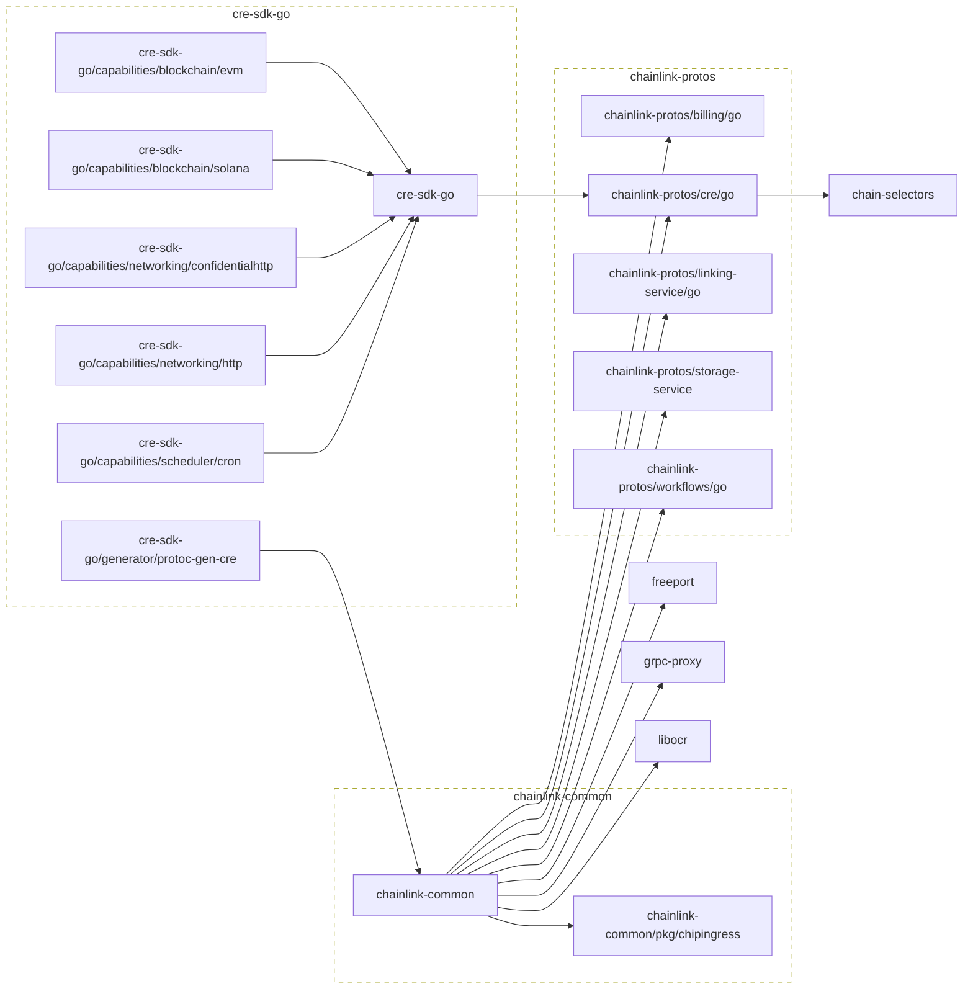

## SDK modules and smartcontractkit org dependencies

```mermaid
flowchart LR

	chain-selectors
	click chain-selectors href "https://github.com/smartcontractkit/chain-selectors"
	chainlink-common --> chainlink-common/pkg/chipingress
	chainlink-common --> chainlink-protos/billing/go
	chainlink-common --> chainlink-protos/cre/go
	chainlink-common --> chainlink-protos/linking-service/go
	chainlink-common --> chainlink-protos/storage-service
	chainlink-common --> chainlink-protos/workflows/go
	chainlink-common --> freeport
	chainlink-common --> grpc-proxy
	chainlink-common --> libocr
	click chainlink-common href "https://github.com/smartcontractkit/chainlink-common"
	chainlink-common/pkg/chipingress
	click chainlink-common/pkg/chipingress href "https://github.com/smartcontractkit/chainlink-common"
	chainlink-protos/billing/go
	click chainlink-protos/billing/go href "https://github.com/smartcontractkit/chainlink-protos"
	chainlink-protos/cre/go --> chain-selectors
	click chainlink-protos/cre/go href "https://github.com/smartcontractkit/chainlink-protos"
	chainlink-protos/linking-service/go
	click chainlink-protos/linking-service/go href "https://github.com/smartcontractkit/chainlink-protos"
	chainlink-protos/storage-service
	click chainlink-protos/storage-service href "https://github.com/smartcontractkit/chainlink-protos"
	chainlink-protos/workflows/go
	click chainlink-protos/workflows/go href "https://github.com/smartcontractkit/chainlink-protos"
	cre-sdk-go --> chainlink-protos/cre/go
	click cre-sdk-go href "https://github.com/smartcontractkit/cre-sdk-go"
	cre-sdk-go/capabilities/blockchain/evm --> cre-sdk-go
	click cre-sdk-go/capabilities/blockchain/evm href "https://github.com/smartcontractkit/cre-sdk-go"
	cre-sdk-go/capabilities/blockchain/solana --> cre-sdk-go
	click cre-sdk-go/capabilities/blockchain/solana href "https://github.com/smartcontractkit/cre-sdk-go"
	cre-sdk-go/capabilities/networking/confidentialhttp --> cre-sdk-go
	click cre-sdk-go/capabilities/networking/confidentialhttp href "https://github.com/smartcontractkit/cre-sdk-go"
	cre-sdk-go/capabilities/networking/http --> cre-sdk-go
	click cre-sdk-go/capabilities/networking/http href "https://github.com/smartcontractkit/cre-sdk-go"
	cre-sdk-go/capabilities/scheduler/cron --> cre-sdk-go
	click cre-sdk-go/capabilities/scheduler/cron href "https://github.com/smartcontractkit/cre-sdk-go"
	cre-sdk-go/generator/protoc-gen-cre --> chainlink-common
	click cre-sdk-go/generator/protoc-gen-cre href "https://github.com/smartcontractkit/cre-sdk-go"
	freeport
	click freeport href "https://github.com/smartcontractkit/freeport"
	grpc-proxy
	click grpc-proxy href "https://github.com/smartcontractkit/grpc-proxy"
	libocr
	click libocr href "https://github.com/smartcontractkit/libocr"

	subgraph chainlink-common-repo[chainlink-common]
		 chainlink-common
		 chainlink-common/pkg/chipingress
	end
	click chainlink-common-repo href "https://github.com/smartcontractkit/chainlink-common"

	subgraph chainlink-protos-repo[chainlink-protos]
		 chainlink-protos/billing/go
		 chainlink-protos/cre/go
		 chainlink-protos/linking-service/go
		 chainlink-protos/storage-service
		 chainlink-protos/workflows/go
	end
	click chainlink-protos-repo href "https://github.com/smartcontractkit/chainlink-protos"

	subgraph cre-sdk-go-repo[cre-sdk-go]
		 cre-sdk-go
		 cre-sdk-go/capabilities/blockchain/evm
		 cre-sdk-go/capabilities/blockchain/solana
		 cre-sdk-go/capabilities/networking/confidentialhttp
		 cre-sdk-go/capabilities/networking/http
		 cre-sdk-go/capabilities/scheduler/cron
		 cre-sdk-go/generator/protoc-gen-cre
	end
	click cre-sdk-go-repo href "https://github.com/smartcontractkit/cre-sdk-go"

	classDef outline stroke-dasharray:6,fill:none;
	class chainlink-common-repo,chainlink-protos-repo,cre-sdk-go-repo outline
```
